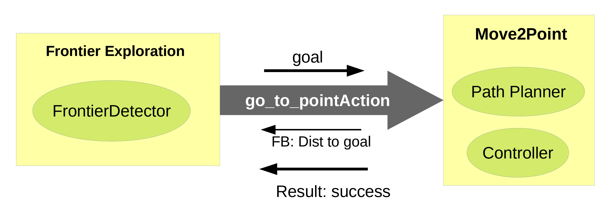
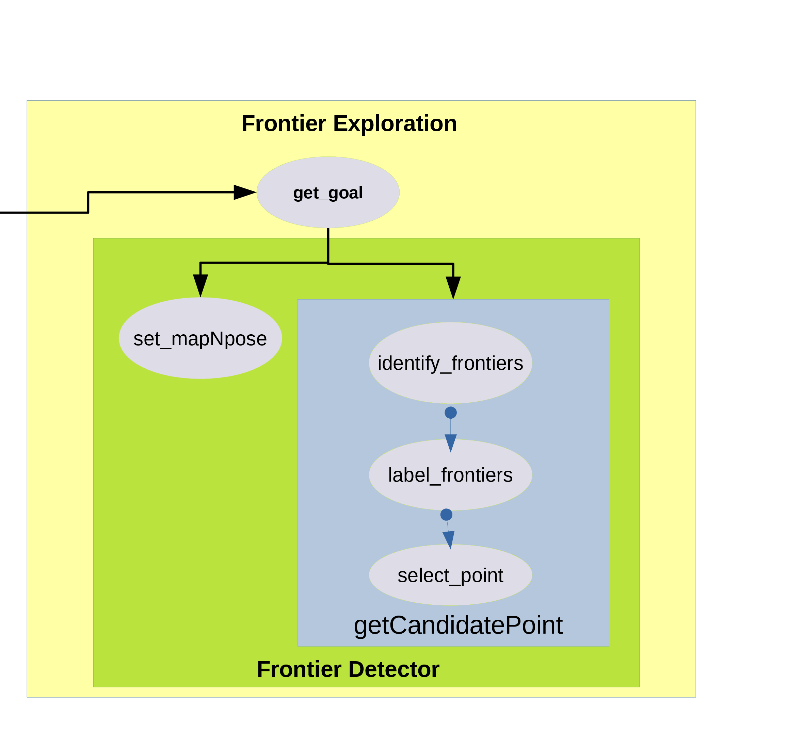
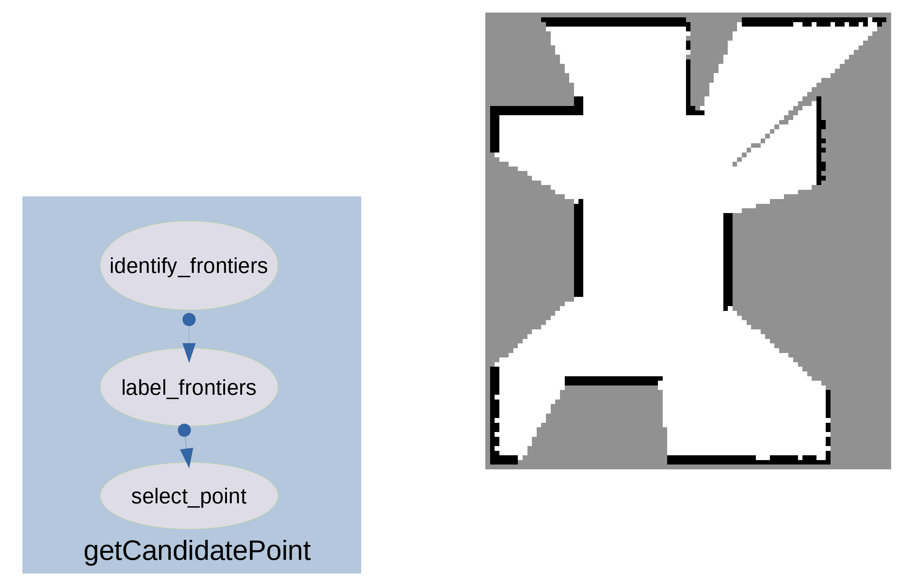
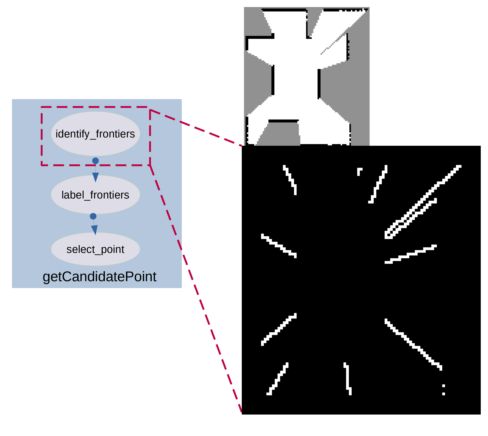
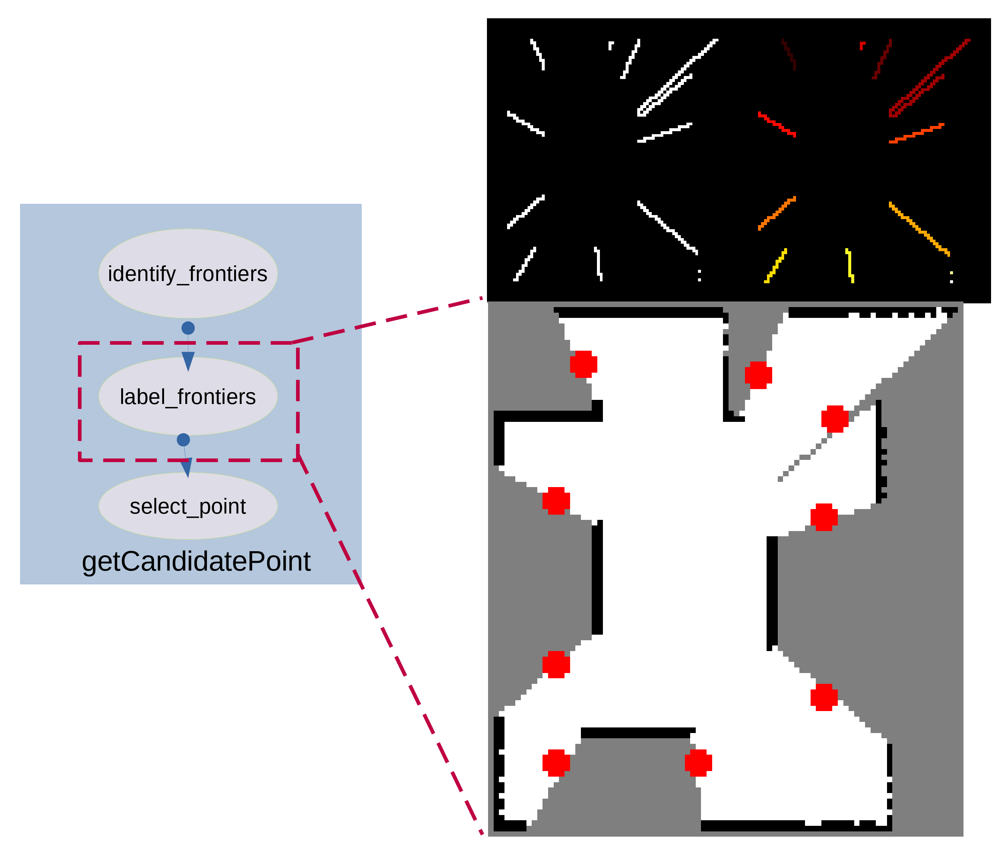
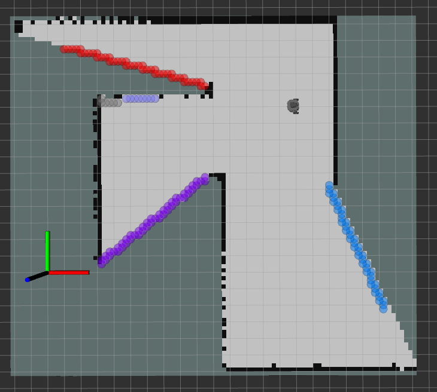
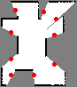

# FExpT2 - Frontier Exploration for Turtlebot2

This package provides a frontier exploration pipeline for Turtlebot2. Six candidate point selection approaches, four path planners (RRT*, Informed RRT*, BIT, FMT) and two path smoothing techniques (B-Spline, Dubins) are implemented. This pipeline allows for rapid testing and evaluation using different configurations and is intended to be easily translatable to other robotic platforms too.

## Dependencies:
- pip install scikit-image

## HOW TO RUN:

1. roslaunch frontier_explorationb frontier_exploration.launch world_name:=pathway.world
2. new terminal: rosrun frontier_explorationb frontier_exploration.py
3. new terminal: rosrun frontier_explorationb move_to_pt.py

# Parameters:

Modify the two attributes in move_to_point.py to set planner configuration (path planner, path smoother and controller). For example:
1. self.planner_config = 'BIT-' (other options: RRTStarOMPL, InRRTStar-, FMT-, BIT-, InRRTStar-Dubins, FMT-Dubins, BIT-Dubins, InRRTStar-BSpline, FMT-BSpline, BIT-BSpline)
2. self.curved_coltroller = False (true if using post processing options ie. dubins or bspline)

Information gain choice can be selected by setting self.criterion variable in frontier_exploration.py. Options available:
0. nearest frontier
1. farthest frontier
2. maximum area
3. maximum information gain (entropy based)
4. biggest cluster
5. dist weighted information gain

General path planner parameters (eg dominion) can be modified from the init of move_to_point. Parameters specific to different path planners need to be modified in utils_lib/path_planners.py file

Update robot width in:
1. frontier_class.py as self.robot_len
2. move_to_point.py as last argument of OnlinePlanner('/projected_map', '/odom', '/cmd_vel', np.array([-15.0, 15.0]), 0.2)

# Code Documentation

There are two main nodes: frontier_exploration and move_to_pt. The comunicated between the two is based on ROS-Actions. Actions are similar to services, but more relavant in case where a node asks the other node to move the robot, and expects some intermediate feedback and a final result when the task is done. In our case, the get_goal() function is called in the init, which continuously iterates sending an action when required and getting feedback and results. I dont know how the while loop in get_goal() is working, but its working so just forget it for now. I will investigate and clean it later.

## frontier_exploration

This node is responsible for processing the occupancy image and getting frontiers. In essence it uses the FrontierDetector class in the frontier_classes.py file in the utils_lib folder. The get_goal() function first calls the setmapNpose() method of the FrontierDetector class, which updates the two respective attributes of the class. Then the get_candidate_point() method of the class is called. This is the main function responsible for using the occupancy map and the pose and returns the candidate points in occupancy map coordinates in a order manner according to the IG criterion specified.

This function achieves its purpose by calling 3 other methods.
The input is an occupancy map as show.

the idenitify_frontiers() method uses this map and does selective edge detection. End output is a binary image with background cells of value 0 and frontier cells with a value of 255. The 255 value is chosen to make image processing in the next function easier

This binary image is used by the label_image() method. It is responsible for labelling or clustered the frontier cells based on connectivity. This is achieved by the scimage package.

The same package is also used to extract the centroids of each of the clustered frontiers. These serve as the candidate (possible goal) points.

The select_point() method is responsible for creating a sorted list of points according to the IG criterion described. Different functions are created for different IG criterion. These include:
1. nearest_frontier
2. farthest_frontier
3. maximum_area
4. maximum_information_gain
5. biggest_cluster
6. dist_weighted_information_gain

Finally after all this, the get_candidate_point() method of the FrontierDetector class returns the ordered list of candidate points to the get_goal function of frontier_exploration node. Then the first point is selected and sent as goal to the move_to_point node.

All other functions in this node are either visualizations or helper functions.

## move_to_pt

The move_to_pt node acts as a action server, which receives the goal point, and responsible for motion planning and control of the robot. The main 2 deisgn choices are motion planner and controller. Currently there are 9 motion planner choices. RRTStarOMPL, InRRTStar-, FMT-, BIT-, InRRTStar-Dubins, FMT-Dubins, BIT-Dubins, InRRTStar-BSpline. FMT-BSpline, BIT-BSpline

The motion planners that include Dubins or Spline need a curved controller. A sample of setting the two variables in the init of the node is shown below:

**self.planner_config = 'BIT-'**

**self.curved_coltroller = False**

The execute_action() function recives the goal from the frontier_exploration client node. It saves goal and plans path. It also returns the action call with feedback (distance to goal) and result (success when goal reached).

get_gridmap() is the occupancy map callback. It stores the map and its info. It also checks if the path is valid, otherwise, it recomputes the path. Additionally it also checks if the goal has become invalid, in which case, it sets reached as True, which promts the frontier_exploration client node to provide a new point.

plan() function calls compute_path(), with the specified planner_config and other planning related parameters. The compute_path() function then computes the path, by calling the appropriate planner and smoother according to he specified planner_config.

controller() function is periodically called to actively steer the robot on the path. Straight line or curved controller is chosen depending on the curved_coltroller attribute specified in init.

## Extras:
Save map node subscribes to the occupancy map and saves the (dilated?) map as a numpy array txt file. 

## Visualizations

**Occupancy Grid**

**Frontier Extraction**

**Clustering**

**Candidate Points Selection**

